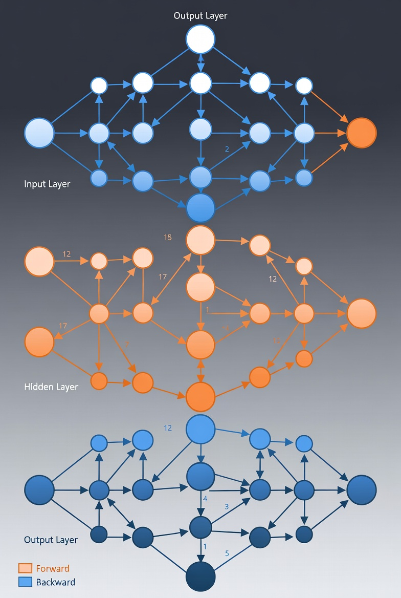

# Python-AI-Skolenie

Kurz *Úvod do veľkých jazykových modelov a AI v dátovej analýze*, kontakt jan.bodnar@gmail.com

Kurz je určený najmä pre dátových analytikov, vývojárov, študentov technických odborov  
a všetkých, ktorí chcú prakticky využívať AI pri každodennej práci s dátami. Po absolvovaní  
kurzu budete schopní rýchlejšie a presnejšie analyzovať dáta, vyvíjať riešenia na báze  
umelej inteligencie a vytvárať prehľadné vizualizácie a reporty s minimálnym množstvom kódu. 

Kurz predpokladá znalosť základov jazyka Python

## Osnovy

### 1. Úvod do veľkých jazykových modelov (LLM)
- Čo sú LLM a prečo sú dôležité
- Prehľad populárnych modelov (napr. GPT — OpenAI, Gemini — Google)
- Typy úloh: generovanie textu, sumarizácia, odpovedanie na otázky (Q&A)
- Základy prompt engineeringu

### 2. Úvod do dátovej analýzy s AI
- Koncept a výhody automatizovanej dátovej analýzy s podporou AI
- Prehľad moderných nástrojov a platforiem integrujúcich AI
- Etické aspekty, riziká a výzvy pri používaní AI v analýze dát

### 3. Príprava a asistovaná analýza dát
- Načítanie, čistenie a predspracovanie dát s knižnicou Pandas
- Interaktívne čistenie a transformácia: Data Wrangler vo VS Code
- Inteligentná analýza dokumentov: NotebookLM
- Google AI Studio: multimodálne úlohy a pokročilý prompt engineering

### 4. Jupyter Notebooks a PandasAI
- Práca v Jupyter Notebooks pre interaktívnu analýzu
- Inštalácia a základné použitie knižnice PandasAI
- Generovanie kódu a odpovedí priamo v Pandas DataFrame
- Praktické príklady: sumarizácia, filtrovanie, transformácie bez zložitého kódu

### 5. Použitie AI asistentov pre vizualizáciu
- Automatické generovanie a optimalizácia kódu pre vizualizácie
- Interaktívne a statické vizualizácie: Matplotlib, Seaborn
- Ako zadávať inštrukcie AI asistentom pre vizualizačné úlohy

### 6. SQL a databázy s podporou AI
- Pripojenie k relačným databázam (napr. PostgreSQL)
- Práca s dátami vo VS Code pomocou pluginov
- Generovanie, optimalizácia a interpretácia SQL dotazov s pomocou AI

### 7. Automatizácia reportingu a prezentácia výsledkov
- Tvorba jednoduchých interaktívnych dashboardov (napr. Streamlit)
- Automatické generovanie textových zhrnutí a analytických postrehov pomocou LLM
- Tipy na efektívnu komunikáciu a prezentáciu výsledkov

## Prompts

- Provide follow up questions
- Suggest defaults

Think of an AI prompt like a recipe or a brief for a freelancer. The more specific the constraints,  
the less likely you are to get a "hallucinated" or generic mess. 

To get the best results, a high-quality prompt usually consists of these five basic parameters:

### 1. The Persona (Who are you?)

Assigning a role sets the tone, vocabulary, and expertise level.

* *Example:* "Act as a senior software engineer" vs. "Act as a five-year-old."

### 2. The Task (What do you want?)

Be direct and use action verbs. Clearly define the goal.

* *Example:* "Summarize this article," "Write a Python script," or "Brainstorm five marketing slogans."

### 3. Context & Constraints (What are the rules?)

This is where you provide the "meat." Give the AI the background info it needs and set boundaries on what it *cannot* do.

* *Example:* "Use a professional tone," "Keep it under 200 words," or "Do not use technical jargon."

### 4. Format (How should it look?)

Tell the AI exactly how to structure the output so you don't have to reformat it yourself.

* *Example:* A bulleted list, a Markdown table, a JSON object, or a three-paragraph email.

### 5. Exemplars (Show, don't just tell)

Providing a single example (often called "one-shot prompting") dramatically improves accuracy.

* *Example:* "Format the data like this: Name: [Name], Age: [Age]."

### The "Perfect Prompt" Framework

If you combine these, your prompt structure looks like this:

| Parameter | Application |
| --- | --- |
| **Persona** | You are an expert career coach. |
| **Task** | Rewrite my resume bullet points to be more impact-oriented. |
| **Context** | I am applying for a Project Manager role at a tech startup. |
| **Constraint** | Use the "Action Verb + Task + Result" formula. |
| **Format** | Present the changes in a "Before vs. After" table. |

> **Quick Tip:** If the AI's first response is "meh," don't start over. Just give it a follow-up
> instruction like, "Make it punchier" or "Add more data points."

## Top Terminal-Based AI CLI Tools (Actively Maintained)

| Tool Name       | Description                                                                 | GitHub Link |
|----------------|-----------------------------------------------------------------------------|-------------|
| **Warp**        | AI-enhanced terminal with autocomplete, command suggestions, and workflows. | [Warp](https://github.com/warpdotdev/Warp) |
| **Gemini CLI**  | Google's CLI interface to Gemini models; supports chaining and background tasks. | [Gemini CLI](https://github.com/google-gemini/gemini-cli) |
| **ForgeCode**   | Multi-LLM CLI agent for scaffolding, refactoring, and reviewing code.       | [ForgeCode](https://github.com/antinomyhq/forge) |
| **Cline**       | Autonomous CLI agent with command execution and web browsing.               | [Cline](https://github.com/cline/cline) |
| **Claude Code** | Anthropic’s CLI agent for structured workflows and parallel execution.      | [Claude Code](https://github.com/anthropics/claude-code) |
| **Codex CLI**   | OpenAI-powered CLI for real-time coding and GitHub integration.             | [Codex CLI](https://github.com/openai/codex) |
| **Aider**       | CLI tool for refactoring and reviewing code with AI.                        | [Aider](https://github.com/Aider-AI/aider) |
| **Continue.dev**| CLI-first agent for code completion and project scaffolding.                | [Continue.dev](https://github.com/continuedev/continue) |
| **TabbyML**     | Local-first AI assistant with CLI hooks; works offline.                     | [TabbyML](https://github.com/TabbyML/tabby) |
| **Void**        | Privacy-focused, offline-capable CLI code editor.                           | [Void](https://github.com/voideditor/void) |
| **Trae**        | ByteDance’s CLI agent for fast prototyping and app generation.              | [Trae](https://github.com/Trae-AI/Trae) |
| **Lovable**     | CLI tool for building mobile/web apps using natural language.               | [Lovable](https://github.com/coppolekkia/Lovable) |
| **Bolt.new**    | CLI-based app builder with prompt-driven workflows.                         | [Bolt.new](https://github.com/stackblitz/bolt.new) |
| **Roocode**     | CLI agent for managing repositories and generating code.                    | [Roocode](https://github.com/RooCodeInc/Roo-Code) |
| **Genie CLI**   | CLI teammate for collaborative engineering tasks.                           | [Genie CLI](https://github.com/kcaldas/genie) |
| **Grok CLI**    | xAI’s CLI agent focused on first-principles reasoning for code.             | [Grok CLI](https://github.com/superagent-ai/grok-cli) |
| **Goose**       | Local, extensible AI agent that automates engineering tasks from start to finish. | [Goose](https://github.com/block/goose) |
| **Crush**       | Glamorous, session-based CLI agent with LSP support and multi-model flexibility. | [Crush](https://github.com/charmbracelet/crush) |

