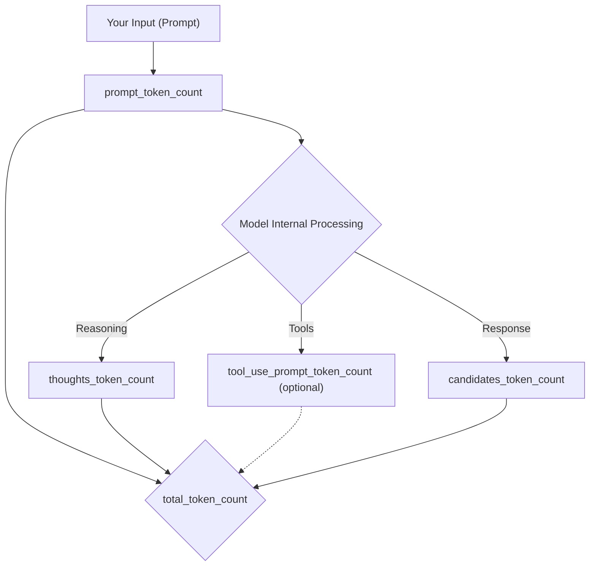

# Google GenAI SDK

The Google GenAI SDK is the official, production-ready gateway  
for developers to integrate Google’s most advanced generative  
AI models into their applications. Also referred to as the  
`google-genai` library, this Software Development Kit (SDK)  
provides a unified, high-performance interface for accessing  
models like Gemini, allowing you to build AI-powered features  
without managing the underlying complexity of API calls.  


As the recommended way to build with the Gemini API, the SDK  
has reached **General Availability (GA)** and is fully supported  
for production use. It represents a significant evolution from  
legacy libraries, offering a streamlined developer experience  
with a focus on consistency and performance. 

### Key Features and Unified Design  

The core strength of the SDK lies in its **centralized architecture**  
In previous versions, managing different services (like generating  
text, handling files, or using chat features) required separate  
clients or inconsistent methods. The new SDK simplifies this by  
providing a single `Client` object that acts as a unified entry point  
for all API services, including model interactions, file uploads,  
caching, and fine-tuning. This design makes credential and  
configuration management straightforward, allowing you to focus on  
building your application's logic. The SDK supports synchronous and  
asynchronous operations and includes strong typing via Pydantic models  
(in Python) to improve code safety and developer experience.  

### Getting Started in Minutes  

The `google-genai` library is available for **Python, JavaScript/TypeScript,  
Go, Java, and C#**, allowing developers to work in their language of choice.  
Installation is simple using standard package managers:  

*   **Python**: `pip install google-genai`  
*   **JavaScript**: `npm install @google/genai`  
*   **Go**: `go get google.golang.org/genai`  
*   **Java**: (Maven) add `google-genai` dependency  
*   **C#**: `dotnet add package Google.GenAI`  

Once installed, creating a client and generating content is just a few  
lines of code. The library supports both the Gemini Developer API (via an  
API key) and enterprise-grade Vertex AI, allowing you to seamlessly scale  
from prototyping to production.  

```python  
from google import genai  
import os
  
# Initialize client with your API key  
api_key = os.getenv("AI_STUDIO_API_KEY")
client = genai.Client(api_key=api_key)  

model = 'gemini-3.1-flash-lite'
prompt = 'Is Pluto a planet?'
  
# Generate content from a text prompt  
response = client.models.generate_content(  
    model=model,  
    contents=prompt,  
)  
  
print(response.text)  
```  

Whether you're building a chatbot, a code assistant, a content generation  
tool, or a multimodal reasoning application, the Google GenAI SDK provides  
the robust, efficient, and future-proof foundation you need to bring your  
ideas to life. We invite you to dive in, explore the official quickstart  
guide, and start building the next generation of AI-powered applications.  

## List models

```python
from google import genai  
import os
  
api_key = os.getenv("AI_STUDIO_API_KEY")
client = genai.Client(api_key=api_key)  

model = 'gemini-3.1-flash-lite'
  
# list models
resp = client.models.list()   

for model in resp:
    print(model.name)
```

## Image description

This snippet is a compact example of image understanding with Gemini. 

```python
from google import genai
from google.genai import types
import os

api_key = os.getenv("AI_STUDIO_API_KEY")
client = genai.Client(api_key=api_key)

model = "gemini-3.1-flash-lite"
prompt = """
Describe the image provided. 
"""

with open("sid.jpg", "rb") as f:
    image_bytes = f.read()

response = client.models.generate_content(
    model=model,
    contents=[
        types.Part.from_bytes(
            data=image_bytes,
            mime_type="image/jpeg",
        ),
        prompt,
    ],
)

print(response.text)
```

It loads a JPEG file from disk, wraps the raw bytes in a Part object with  
the correct MIME type, and sends both the image and a short text prompt  
to the `generate_content` endpoint. The model processes the image, interprets  
its visual content, and returns a natural‑language description, which the  
script prints to the console.

From URL.

```python
from google import genai
from google.genai import types
import requests
import os

api_key = os.getenv("AI_STUDIO_API_KEY")
client = genai.Client(api_key=api_key)

model = "gemini-3.1-flash-lite"
# model = "gemini-3.5-flash"
prompt = """
Describe the image provided. 
"""


image_path = "https://ipravda.sk/res/2016/07/29/thumbs/jubileum-nestandard1.jpg"
image_bytes = requests.get(image_path).content
image = types.Part.from_bytes(data=image_bytes, mime_type="image/jpeg")

response = client.models.generate_content(
    model=model,
    contents=["What is this image?", image],
)

print(response.text)
```

## Image creation

```python
from google import genai
from google.genai import types
from PIL import Image

import os

api_key = os.getenv("AI_STUDIO_API_KEY")
client = genai.Client(api_key=api_key)

model = "gemini-3.1-flash-image"

prompt = """
Create an image of Ferdo mravec, Včielka Maja, Chrobak Truhlik and their friends
in a beautiful garden, enjoying a sunny day together. The scene should be
vibrant and colorful, capturing the essence of friendship and nature.
"""
response = client.models.generate_content(
    model=model,
    contents=[prompt],
)

for part in response.parts:
    if part.text is not None:
        print(part.text)
    elif part.inline_data is not None:
        image = part.as_image()
        image.save("generated_image.png")
```

## Temperatrure and top_p

`Temperature` is a parameter that controls how *bold or conservative* a model’s  
word choices are by scaling the entire probability distribution of possible  
next tokens; when the temperature is low, the model behaves predictably and  
sticks to the safest, most likely answers, while a higher temperature makes  
it more adventurous, creative, and willing to pick less probable options. 

`Top‑p`, on the other hand, limits randomness by restricting the model to a  
subset of tokens whose combined probability mass reaches a chosen threshold  
`p`, meaning the model only samples from the “most likely” portion of the  
distribution rather than considering every possible token.  

The key difference is that temperature reshapes the whole probability  
landscape—making it flatter or sharper—while `top‑p` trims the landscape by  
cutting off the long tail of unlikely tokens and sampling only from the  
nucleus of probable ones. Temperature affects *how* probabilities are  
distributed, whereas `top‑p` affects *which* probabilities are even allowed 
into the sampling pool, giving you two complementary ways to tune creativity  
and control.

### Common temerature and top_p values

Here’s a table with commonly used `temperature` and `top_p` values for different tasks with models:

| Task Type         | temperature | top_p | Description                                      |
|-------------------|-------------|-------|--------------------------------------------------|
| Creative Writing  | 0.7–1.0     | 0.9–1 | More randomness and diversity for creativity      |
| Factual QA        | 0.0–0.3     | 0.8–1 | Deterministic, focused, less risk of hallucination|
| Summarization     | 0.3–0.7     | 0.8–1 | Balanced, concise, and relevant output           |
| Code Generation   | 0.2–0.5     | 0.8–1 | Accurate, less creative, more reliable code       |
| Brainstorming     | 0.8–1.0     | 0.9–1 | Highly creative, many ideas, less repetition      |
| Translation       | 0.3–0.7     | 0.8–1 | Balanced, accurate, and fluent translations       |

For creative writing, typical values are:
- `temperature = 0.7–1.0`
- `top_p = 0.9–1.0`

In the Google genai SDK, the defaults are:

- temperature: 1.0
- top_p: 0.95


```python
"""Demonstrates temperature and top_p parameters in the Google genai SDK.

temperature (0.0–2.0):
  - Controls the randomness of token selection.
  - Lower values (e.g. 0.0) make output more deterministic and focused.
  - Higher values (e.g. 1.5) make output more creative, surprising, and diverse.

top_p (0.0–1.0):
  - Nucleus sampling: only tokens whose cumulative probability ≤ top_p are considered.
  - Lower values (e.g. 0.1) produce more focused, conservative output.
  - Higher values (e.g. 0.9) allow more diversity.
  - Recommend changing one at a time, not both simultaneously.

Run this script multiple times to observe the variability!
"""

from google import genai
from google.genai import types
import os

api_key = os.getenv("AI_STUDIO_API_KEY")
client = genai.Client(api_key=api_key)

model = "gemini-2.5-flash"
prompt = "Write a one-sentence tagline for a futuristic coffee shop."

# ── 1. Deterministic (temperature=0.0, top_p=1.0) ──────────────
config_deterministic = types.GenerateContentConfig(
    temperature=0.0,
    top_p=1.0,
)

response = client.models.generate_content(
    model=model,
    contents=prompt,
    config=config_deterministic,
)
print(f"── Deterministic (temp=0.0, top_p=1.0) ──────────────")
print(f"{response.text}\n")

# ── 2. Creative (temperature=1.2, top_p=0.95) ──────────────────
config_creative = types.GenerateContentConfig(
    temperature=1.2,
    top_p=0.95,
)

response = client.models.generate_content(
    model=model,
    contents=prompt,
    config=config_creative,
)
print(f"── Creative (temp=1.2, top_p=0.95) ───────────────────")
print(f"{response.text}\n")

# ── 3. Focused (temperature=0.3, top_p=0.1) ────────────────────
config_focused = types.GenerateContentConfig(
    temperature=0.3,
    top_p=0.1,
)

response = client.models.generate_content(
    model=model,
    contents=prompt,
    config=config_focused,
)
print(f"── Focused (temp=0.3, top_p=0.1) ─────────────────────")
print(f"{response.text}\n")

# ── 4. Highly random (temperature=1.8, top_p=1.0) ──────────────
config_random = types.GenerateContentConfig(
    temperature=1.8,
    top_p=1.0,
    # Safety settings are kept at defaults for this example.
)

response = client.models.generate_content(
    model=model,
    contents=prompt,
    config=config_random,
)
print(f"── Highly random (temp=1.8, top_p=1.0) ───────────────")
print(f"{response.text}\n")

print("─" * 50)
print("Run this script a few times — low-temperature outputs will stay")
print("similar, while high-temperature outputs will vary widely.")
```

| # | Config | Observed behavior |
|---|---|---|
| **1** | `temp=0.0, top_p=1.0` | **Deterministic** — gives the same 5 safe taglines every run |
| **3** | `temp=0.3, top_p=0.1` | **Focused** — very similar to temp=0.0, nearly identical outputs |
| **2** | `temp=1.2, top_p=0.95` | **Creative** — more varied phrasing, explores different angles |
| **4** | `temp=1.8, top_p=1.0` | **Highly random** — wild single-line output like *"Harnessing quantum beans to brew your next-gen daily boost"* |


## Thinking level

Thinking level is a setting that controls how much internal reasoning the model  
performs before producing its final answer. A higher level encourages deeper,  
more structured analysis, while a lower level keeps responses fast and direct.  
This allows developers to choose between quick replies and more deliberate,  
thoughtful output depending on the needs of their application or prompt.  


```python
from google import genai
from google.genai import types
import os
  
# Initialize client with your API key  
api_key = os.getenv("AI_STUDIO_API_KEY")
client = genai.Client(api_key=api_key)  
model = 'gemini-3.1-flash-lite'
  
# Generate content from a text prompt  
response = client.models.generate_content(  
    model=model,  
    contents='Is Pluto a planet?',  
    config=types.GenerateContentConfig(  
        thinking_config=types.ThinkingConfig(thinking_level='medium')  
    )
)  
  
print(response.text)  
```

This code sends a simple question to the Gemini model and configures it to use  
a medium thinking level, which instructs the model to perform a deeper round  
of internal reasoning before producing its final answer. The example sets the  
`thinking_level` option to `medium`, encouraging the model to analyze the prompt  
more carefully and generate a more deliberate and thoughtful response while  
keeping the overall structure of the script straightforward and easy to read.  


## Tokens used

Tokens are the small units—pieces of words, punctuation, or symbols—that a language  
model uses to read your input and generate its output, and token usage refers  
to how many of these units are consumed during a request, including your prompt,  
the model’s visible answer, its hidden reasoning, and any tool‑related steps.  
Because every interaction is processed in tokens, usage directly determines cost,  
latency, and model limits, making token accounting essential for understanding  
how efficiently a request was handled.

| Term | Meaning |
| --- | --- |
| **prompt_token_count** | Number of tokens in your **input** (the text, files, or instructions you sent to the model). |
| **candidates_token_count** | Number of tokens in the **model’s final visible answer** (the chosen candidate). Even if only one answer is returned, it is still called a “candidate.” |
| **thoughts_token_count** | Number of tokens used in the model’s **hidden reasoning**, which is not shown to you but counted for billing and transparency. |
| **total_token_count** | The **sum of all tokens** used: prompt + candidate response + hidden reasoning + any tool‑related tokens. |
| **cached_content_token_count** | Number of tokens retrieved from cache instead of recomputed. Saves cost and latency. |
| **tool_use_prompt_token_count** | Tokens used to generate instructions for tools (like code execution or search). |




```python
from google import genai  
from google.genai import types
import os
  
# Initialize client with your API key  
api_key = os.getenv("AI_STUDIO_API_KEY")
client = genai.Client(api_key=api_key)  

model = 'gemini-3.1-flash-lite'
prompt = '''
Is Pluto a planent. Answer in a paragraph. 
'''

# Generate content from a text prompt  
response = client.models.generate_content(  
    model=model,  
    contents=prompt,  
    config=types.GenerateContentConfig(  
        thinking_config=types.ThinkingConfig(thinking_level='medium')  
    )
)  
  
print(response.text)  
print(response.usage_metadata.prompt_token_count)
print(response.usage_metadata.cached_token_count)
print(response.usage_metadata.candidates_token_count)
print(response.usage_metadata.total_token_count)
```

The example shows the token usage for a single prompt. 

## Streaming

```python
from google import genai
import os
  
# Initialize client with your API key  
api_key = os.getenv("AI_STUDIO_API_KEY")
client = genai.Client(api_key=api_key)  
model = 'gemini-3.1-flash-lite'
prompt = "Is Pluto a planet?"

response = client.models.generate_content_stream(
    model=model,
    contents=[prompt]
)
for chunk in response:
    print(chunk.text, end="")
```

## Multi-turn conversations

The SDK allows to collect multiple rounds of prompts and responses into a chat,  
giving you an easy way to keep track of the conversation history.

Note: Chat functionality is only implemented as part of the SDKs. Behind the scenes,  
it still uses the `generateContent` function. For multi-turn conversations,  
the *full conversation history* is sent to the model with each follow-up turn.

```python
from google import genai
import os

api_key = os.getenv("AI_STUDIO_API_KEY")
client = genai.Client(api_key=api_key)
model = "gemini-3.1-flash-lite"

chat = client.chats.create(model=model)

response = chat.send_message("What is the capital of France?")
print(response.text)

response = chat.send_message("And of Slovakia?")
print(response.text)

for message in chat.get_history():
    print(f"role - {message.role}", end=": ")
    print(message.parts[0].text)
```

## Code execution

```python
from google import genai  
from google.genai import types
import os
  
# Initialize client with your API key  
api_key = os.getenv("AI_STUDIO_API_KEY")
client = genai.Client(api_key=api_key)  

model = 'gemini-3.1-flash-lite'
prompt = '''
What is the sum of the first 50 prime numbers? 
Generate and run code for the calculation, and make sure you get all 50.
'''

response = client.models.generate_content(
    model=model,
    contents=prompt,
    config=types.GenerateContentConfig(
        tools=[types.Tool(code_execution=types.ToolCodeExecution)]
    ),
)

for part in response.candidates[0].content.parts:
    if part.text is not None:
        print(part.text)
    if part.executable_code is not None:
        print(part.executable_code.code)
    if part.code_execution_result is not None:
        print(part.code_execution_result.output)
```


## Get a list of articles

```python
from google import genai  
import os
import requests
  
api_key = os.getenv("AI_STUDIO_API_KEY")
client = genai.Client(api_key=api_key)  
# model = 'gemini-3.1-flash-lite'
model = 'gemini-3.5-flash'


def get_page(url):

    resp = requests.get(url)
    resp.raise_for_status()

    return resp.text

url = "https://hnonline.sk/"

page_content = get_page(url)

prompt = f'''
list all titles of articles published today on the website. The HTML content of
the page is as follows: {page_content}
'''

response = client.models.generate_content(
    model=model,
    contents=prompt,
)

print(response.text)
```

## Grounding

Grounding means giving an AI access to verified external information—such  
as search results or documents—so its answers are based on real, current  
facts rather than only its internal training data. It helps the model reduce  
hallucinations by tying its responses directly to authoritative sources.  

```python
from google import genai
from google.genai import types
from google.genai.errors import ClientError
import os

api_key = os.getenv("AI_STUDIO_API_KEY")
client = genai.Client(api_key=api_key)

model = "gemini-3.1-flash-lite"


grounding_tool = types.Tool(google_search=types.GoogleSearch())

config = types.GenerateContentConfig(tools=[grounding_tool])

try:
    response = client.models.generate_content(
        model=model,
        contents="Who won the FO 2026?",
        config=config,
    )

    print(response.text)

except ClientError as e:
    print(e.status)
    print(e.message)
```

This example shows how to call the Gemini `generate_content` API with  
**Google Search grounding enabled**, allowing the model to answer questions  
using up‑to‑date web information; the script initializes a Gemini client,  
defines a `GoogleSearch` tool inside a `GenerateContentConfig`, and sends  
a query (“Who won the FO 2026?”) to the lightweight `gemini-3.1-flash-lite`  
model, while wrapping the call in a `try/except` block to catch and display  
any `ClientError` returned by the API.

## Summarize PDF

The next example summarizes a PDF file. 

```python
from google import genai
from google.genai import types
import httpx
import os

api_key = os.getenv("AI_STUDIO_API_KEY")
client = genai.Client(api_key=api_key)
model = "gemini-3.1-flash-lite"

doc_url = "https://web2.mlp.cz/koweb/00/03/73/22/08/neprebudeny.pdf"

# Retrieve and encode the PDF byte
doc_data = httpx.get(doc_url).content

prompt = "Summarize this document"
response = client.models.generate_content(
    model=model,
    contents=[
        types.Part.from_bytes(
            data=doc_data,
            mime_type='application/pdf',
        ),
        prompt
    ]
)

print(response.text)
```

This example shows how to use the Google Gemini `generate_content` API to  
download a PDF from a remote URL, encode it as binary data, and send it  
to the lightweight `gemini-3.1-flash-lite` model together with a text prompt  
so the model can read and summarize the document; the script retrieves  
the API key from an environment variable, fetches the PDF using `httpx`,  
wraps the file bytes in a `types.Part` object with the correct MIME type,  
submits both the document and the prompt in a single multimodal request,  
and finally prints the summary returned by the model.

## Audio transcription

Audio transcription is the process of converting spoken words from an audio  
recording into written text. It allows you to turn speech—whether from  
conversations, lectures, podcasts, or voice notes—into a readable, searchable  
format that can be analyzed, edited, or used in downstream tasks.

```python
from google import genai  
from google.genai import types
import os
  
api_key = os.getenv("AI_STUDIO_API_KEY")
client = genai.Client(api_key=api_key)  

model = 'gemini-3.1-flash-lite'
prompt = '''
Generate a transcript of the speech. Skip the introduction and conclusion. 
'''

with open('aesop_cat_mice.mp3', 'rb') as f:
    audio_bytes = f.read()

response = client.models.generate_content(
  model=model,
  contents=[
    prompt,
    types.Part.from_bytes(
      data=audio_bytes,
      mime_type='audio/mp3',
    )
  ]
)

print(response.text)
```

This script sends an audio file to Gemini and asks the model to generate  
a transcript, while ignoring the introduction and conclusion. It loads  
an MP3 file as raw bytes, wraps it in a `types.Part.from_bytes` object with  
the correct MIME type, and sends both the prompt and the audio to  
`generate_content`. The model processes the audio, produces a text transcript, 
and the script prints the result.


## Classification

Classification is the process of assigning items, data, or observations into predefined  
categories based on their characteristics. In machine learning and AI, it means mapping  
inputs to one label from a fixed set of labels.

```python
import os
from google import genai

api_key = os.getenv("AI_STUDIO_API_KEY")
client = genai.Client(api_key=api_key)

# The items to classify
items = ["elephant", "mouse", "dog", "snail", "giraffe", "ant"]
prompt = f"Classify the following items as [large, medium, small, tiny]:\n" + "\n".join(items)
model = 'gemini-3.1-flash-lite'

system_instruction = """
You are a helpful assistant that classifies items strictly into the categories provided.
"""

# Use system_instruction to ensure the model stays on task
response = client.models.generate_content(
    model=model, 
    config={
        'system_instruction': system_instruction
    },
    contents=prompt
)

print("Classification Results:")
print(response.text)
```

The example shows a short Python script that sends a list of animals to Google's  
Gemini model and asks it to classify each one into one of four size categories—large, 
medium, small, or tiny—by building a prompt, adding a system instruction to keep  
the model focused, sending everything through the `generate_content` call, and finally  
printing the model’s textual classification results.


### Classifying tickets

Classification of customer tickets.

```python
import argparse
import os
from textwrap import dedent

from google import genai
from pydantic import BaseModel
from rich.console import Console
from rich.table import Table


DEFAULT_MODEL = "gemini-3.1-flash-lite"

CATEGORIES = ["billing", "technical", "account", "shipping", "other"]

TICKETS = [
    "My last invoice seems too high, can you check the charges?",
    "I can't log in after resetting my password.",
    "Where is my package? The tracking has not updated for 3 days.",
    "How do I change the email on my profile?",
    "The app crashes when I try to upload a file.",
    "I was billed twice for the same subscription this month.",
    "My profile picture keeps disappearing after I upload it.",
    "Can I get a refund for the duplicate charge?",
    "The login page shows an error after the latest update.",
    "I need to update my shipping address before the order ships.",
]


class TicketClassification(BaseModel):
    ticket: str
    category: str


class ClassificationResult(BaseModel):
    classifications: list[TicketClassification]


def parse_args():
    parser = argparse.ArgumentParser(description="Ticket classification demo.")
    parser.add_argument("--model", type=str, default=DEFAULT_MODEL,
                        help=f"LLM model (default: {DEFAULT_MODEL})")
    return parser.parse_args()


def classify_tickets(client, model, tickets):
    system_instruction = dedent(f"""
        You are a helpful assistant that classifies short customer support tickets.
        Classify each ticket into one of these categories: {CATEGORIES}.
    """).strip()

    ticket_list = "\n".join(f"{i+1}. {t}" for i, t in enumerate(tickets))
    prompt = f"Classify the following tickets:\n{ticket_list}"

    response = client.models.generate_content(
        model=model,
        contents=prompt,
        config={
            "system_instruction": system_instruction,
            "response_mime_type": "application/json",
            "response_schema": ClassificationResult,
        },
    )

    return response.parsed.classifications  # list[TicketClassification]


def main():
    args = parse_args()
    api_key = os.getenv("AI_STUDIO_API_KEY")
    client = genai.Client(api_key=api_key)

    print("Task: Classify support tickets into one of", CATEGORIES)
    print("\nTickets:")
    for i, t in enumerate(TICKETS, 1):
        print(f"{i}. {t}")

    # Classify all tickets in one request
    classifications = classify_tickets(client, args.model, TICKETS)

    # Summary table
    console = Console()
    table = Table(title="Classification Summary")
    table.add_column("#", justify="right")
    table.add_column("Ticket", max_width=60)
    table.add_column("Category")

    for i, item in enumerate(classifications, 1):
        table.add_row(str(i), item.ticket, item.category)
    console.print(table)


if __name__ == "__main__":
    main()
```

Classifies customer support tickets using Google's Gemini API with typed   
structured output. Pydantic models (`TicketClassification` and `ClassificationResult`)    
define the expected JSON schema. The API is configured with response_schema to    
guarantee type-safe, structured responses. Results are displayed in a rich table.  

## Sentiment analysis

Sentiment analysis is the process of using computational methods to determine the  
emotional tone expressed in text—typically classifying it as positive, negative,  
or neutral, or assigning a numerical score that reflects how favorable or unfavorable  
the sentiment is.

```python
"""
sentiment_analysis.py

Analyzes sentiment of Slovak movie reviews using Gemini's typed structured
output. All reviews are sent in a single request — the Pydantic model
ReviewSentiment defines the expected schema (id, review, sentiment score 0-1),
and ReviewSentimentList wraps all results. The API returns a validated typed
response instead of needing 10 separate requests.
"""

import os
from google import genai
from pydantic import BaseModel


slovak_movie_reviews = {
    1: "Príbeh bol úplne pútavý a herecké výkony brilantné. Nemohol som sa odtrhnúť ani na sekundu!",
    2: "Tempo bolo mimoriadne pomalé a postavy nemali žiadnu hĺbku. Nudil som sa už v polovici.",
    3: "Hoci vizuálne efekty boli ohromujúce, dej pôsobil predvídateľne a bez inšpirácie.",
    4: "Toto je filmové dielo, ktoré mi dojalo srdce. Každá scéna bola dokonalosť!",
    5: "Dialógy boli trápne a humor úplne zlyhal. Určite to nestojí za ten humbug.",
    6: "Bol to priemerný film - nie dobrý, ale ani úplná katastrofa. Niektoré časti ma bavili.",
    7: "Chemia medzi hlavnými postavami bola elektrizujúca a soundtrack fenomenálny!",
    8: "Film začal skvele, ale v druhej polovici sa úplne rozpadol. Veľké sklamanie.",
    9: "Vizualne ohromujúci film, ktorý dokonale spája akciu a emócie. Určite odporúčam!",
    10: "Premisa bola zaujímavá, ale realizácia bola slabá. Nedokázalo ma to zaujať."
}


class ReviewSentiment(BaseModel):
    id: int
    review: str
    sentiment: float  # 0.0 = very negative, 1.0 = very positive


class ReviewSentimentList(BaseModel):
    reviews: list[ReviewSentiment]


api_key = os.getenv("AI_STUDIO_API_KEY")
client = genai.Client(api_key=api_key)

# Build a single prompt with all reviews
review_lines = "\n".join(
    f"{k}. {v}" for k, v in slovak_movie_reviews.items()
)
prompt = f"""
Ohodnoť sentiment nasledujúcich recenzií filmov.
Pre každú recenziu vráť id, presné znenie recenzie a sentiment na škále od 0 do 1
(0 = veľmi negatívny, 1 = veľmi pozitívny).

Recenzie:
{review_lines}
"""

response = client.models.generate_content(
    model="gemini-3.1-flash-lite",
    contents=prompt,
    config={
        "response_mime_type": "application/json",
        "response_schema": ReviewSentimentList,
    },
)

# Print results
for r in response.parsed.reviews:
    print(f"{r.id}. [sentiment: {r.sentiment:.2f}] {r.review}")
```

The provided script performs sentiment analysis on a set of Slovak movie reviews  
by sending all ten reviews in a single request to the Gemini model, which is instructed  
to return structured JSON that matches two Pydantic models: one describing each  
review's ID, text, and a sentiment score between 0 and 1, and another wrapping the full list.  
Instead of making separate API calls for each review, the program builds one combined prompt, 
requests a typed JSON response, and receives a validated Python object containing all  
sentiment results. It then iterates through the parsed output and prints each review  
alongside its computed sentiment score, giving a clear, efficient overview of how positively  
or negatively each movie review was interpreted.

## Analyze CSV data

Simple data analysis. 

```csv
id,first_name,last_name,email,occupation,salary,created_at
1,Jana,Nováková,jana.novakova@gmail.com,Software Engineer,3200.0,2026-01-01
2,Peter,Kováč,peter.kovac@example.com,Data Analyst,2800.0,2026-01-02
3,Lucia,Horváthová,lucia.horvathova@example.com,Project Manager,3500.0,2026-01-03
4,Martin,Tóth,martin.toth@example.com,UX Designer,3000.0,2026-01-04
5,Simona,Varga,simona.varga@example.com,QA Engineer,2700.0,2026-01-05
6,Marek,Polák,marek.polak@example.com,DevOps Engineer,3400.0,2026-01-06
7,Zuzana,Bartošová,zuzana.bartosova@example.com,HR Specialist,2500.0,2026-01-07
8,Tomáš,Urban,tomas.urban@example.com,Business Analyst,2900.0,2026-01-08
9,Barbora,Králová,barbora.kralova@simplemail.com,Marketing Manager,3300.0,2026-01-09
10,Jozef,Šimek,jozef.simek@example.com,System Administrator,3100.0,2026-01-10
11,Michaela,Dudová,michaela.dudova@example.com,Content Writer,2200.0,2026-01-11
12,Richard,Bielik,richard.bielik@example.com,Product Owner,3600.0,2026-01-12
13,Katarína,Farkašová,katarina.farkasova@gmail.com,Accountant,2600.0,2026-01-13
14,Andrej,Gregor,andrej.gregor@example.com,Network Engineer,3200.0,2026-01-14
15,Veronika,Kučerová,veronika.kucerova@gmail.com,Graphic Designer,2400.0,2026-01-15
16,Patrik,Holub,patrik.holub@gmail.com,Mobile Developer,3300.0,2026-01-16
17,Eva,Švecová,eva.svecova@example.com,Recruiter,2300.0,2026-01-17
18,Roman,Marek,roman.marek@simplemail.com,Database Administrator,3400.0,2026-01-18
19,Monika,Blažeková,monika.blazekova@example.com,Scrum Master,3100.0,2026-01-19
20,Filip,Klein,filip.klein@example.com,Web Developer,3000.0,2026-01-20
```

We have these 20 rows. To do the analysis, we utilize `types.ToolCodeExecution`. 

```python
from google import genai
from google.genai import types
from pydantic import BaseModel
import os

api_key = os.getenv("AI_STUDIO_API_KEY")
client = genai.Client(api_key=api_key)

file_name = "users.csv"


class SalaryReport(BaseModel):
    minimum: float
    maximum: float
    sum: float
    average: float


with open(file_name, "r", encoding="utf-8") as file:
    data = file.read()

    prompt = f"""Generate a report containing minimum, maximum, sum, and average of salaries
    from the CSV data provided. Write and run Python code to analyze the data.
    Please provide the results in JSON format.\n\nData:\n{data}"""

    response = client.models.generate_content(
        model="gemini-3.1-flash-lite",
        contents=prompt,
        config=types.GenerateContentConfig(
            tools=[types.Tool(code_execution=types.ToolCodeExecution)],
            response_mime_type="application/json",
            response_json_schema=SalaryReport.model_json_schema(),
        ),
    )

    report = SalaryReport.model_validate_json(response.text)
    print(report.model_dump_json(indent=2))

    print('------------------------------')

    print(report.minimum)
    print(report.maximum)
    print(report.sum)
    print(report.average)

    print('------------------------------')

    print(response.code_execution_result)
    print(response.executable_code)
```

This example reads a local CSV file containing user salary data and sends  
it to the Gemini API along with a prompt instructing the model to write and  
execute Python code to compute the minimum, maximum, sum, and average of the  
salaries; the request enables the built‑in code execution tool and specifies  
that the response must be valid JSON matching a `SalaryReport` Pydantic schema,  
after which the returned JSON is validated and parsed into a `SalaryReport` 
object and printed in a nicely formatted structure.

### Filtering female users

The next example filters out all female users from the CSV file.

```python
"""
filter_female.py

This program reads a CSV file (users.csv) containing user data, uses the
Gemini API (gemini-3.1-flash-lite) to classify each user's first name as
'female' or 'male' (supporting Czech/Slovak names), filters the dataset to
keep only female users, prints the results in a formatted table, and saves
the filtered data to a new CSV file (female_users.csv).
"""

import os
import csv
from google import genai
from pydantic import BaseModel

api_key = os.getenv("AI_STUDIO_API_KEY")
client = genai.Client(api_key=api_key)


class GenderClassification(BaseModel):
    gender: str  # "female" or "male"


# Read users from CSV
users = []
with open("users.csv", "r", encoding="utf-8") as f:
    reader = csv.DictReader(f)
    for row in reader:
        users.append(row)

# Build list of first names to classify
first_names = [u["first_name"] for u in users]
prompt = f"""Classify each of the following first names by gender. 
    These are Czech/Slovak names. Respond with a JSON object mapping each 
    name to 'female' or 'male'.\n\n {first_names}
    """

system_instruction = """
You are an expert in Czech and Slovak given names. Classify each name strictly
as 'female' or 'male'. Return a JSON object where each key is the exact first
name and the value is either 'female' or 'male'. Only return the JSON object, no
other text.
"""

model = 'gemini-3.1-flash-lite'

response = client.models.generate_content(
    model=model,
    config={"system_instruction": system_instruction},
    contents=prompt,
)

# Parse the classification result
import json

# Clean up markdown code fences if present
text = response.text.strip()
if text.startswith("```"):
    text = text.split("\n", 1)[1]
    if text.endswith("```"):
        text = text[:-3]
    text = text.strip()

classification = json.loads(text)
print("Gender classification:")
for name, gender in classification.items():
    print(f"  {name}: {gender}")

# Filter female users
female_users = [u for u in users if classification.get(u["first_name"]) == "female"]

print(f"\n{'='*60}")
print(f"Total users: {len(users)}")
print(f"Female users: {len(female_users)}")
print(f"{'='*60}\n")

# Print female users
print("Female users:")
print(
    f"{'ID':<5} {'First Name':<15} {'Last Name':<15} {'Email':<40} {'Occupation':<25} {'Salary':<10}"
)
print("-" * 120)
for u in female_users:
    print(
        f"{u['id']:<5} {u['first_name']:<15} {u['last_name']:<15} {u['email']:<40} {u['occupation']:<25} {u['salary']:<10}"
    )

# Save filtered results to a new CSV
file_name = "female_users.csv"
with open(file_name, "w", encoding="utf-8", newline="") as f:
    writer = csv.DictWriter(f, fieldnames=users[0].keys())
    writer.writeheader()
    writer.writerows(female_users)

print(f"\nFiltered results saved to '{file_name}'")
```

This example loads user records from a CSV file, sends all first names to  
the Gemini model to classify them as either female or male—specifically tuned  
for Czech and Slovak naming conventions—parses the model’s JSON response,  
filters the original dataset to keep only users whose first names were labeled  
female, prints a neatly formatted table of those filtered users, and finally  
saves the resulting subset into a new CSV file called `female_users.csv`.


## Data extraction

Data extraction is the process of pulling specific pieces of information out of  
a larger source—such as a file, database, webpage, or dataset—so that the extracted  
data can be analyzed, transformed, or used for further processing.  

```python
import os
from google import genai

api_key = os.getenv("AI_STUDIO_API_KEY")
client = genai.Client(api_key=api_key)

model = "gemini-3.1-flash-lite"
prompt = """
Extract information about people mentioned in the following text. For each
person, provide their name, age, and city of residence in a structured JSON
format. John Doe is a software engineer living in New York. He
is 30 years old and enjoys hiking and photography. Jane Smith is a graphic
designer based in San Francisco. She is 28 years old and loves painting and
traveling."""


response = client.models.generate_content(
    model=model,
    contents=prompt,
    config={
        "response_mime_type": "application/json",
    },
)

print(response.text)
```

In the next example, we specify the JSON output with Pydantic.


```python
import os
from google import genai
from pydantic import BaseModel

api_key = os.getenv("AI_STUDIO_API_KEY")
client = genai.Client(api_key=api_key)


class Person(BaseModel):
    name: str
    age: int
    city: str


class ExtractionResult(BaseModel):
    people: list[Person]


model = "gemini-3.1-flash-lite"
prompt = """
Extract information about people mentioned in the following text. For each
person, provide their name, age, and city of residence. John Doe is a software
engineer living in New York. He is 30 years old and enjoys hiking and
photography. Jane Smith is a graphic designer based in San Francisco. She is
28 years old and loves painting and traveling."""


response = client.models.generate_content(
    model=model,
    contents=prompt,
    config={
        "response_mime_type": "application/json",
        "response_schema": ExtractionResult,
    },
)

result = response.parsed  # returns ExtractionResult instance
print(result.model_dump_json(indent=2))
```

The program demonstrates how to use Gemini's structured output (typed JSON response) with  
Pydantic models. Two model classes — `Person` and `ExtractionResult` — define the  
expected schema. The API is configured with response_schema pointing to  
`ExtractionResult` and response_mime_type set to "application/json", which  
guarantees the response conforms to the specified types. The parsed result is  
returned as a Pydantic instance (`response.parsed`) and printed as pretty-printed  
JSON.

## Shell code execution

In the context of AI, shell code execution refers to an AI system generating or running  
commands in a computer’s command‑line environment (like Bash or PowerShell) to perform tasks  
such as manipulating files, launching programs, or interacting with the operating system. 

When AI models are involved, this usually means the model is either producing shell commands  
as output or triggering their execution through a controlled tool or sandbox. Because shell  
commands can directly affect the system, AI‑driven shell execution is always handled with  
strict safeguards to prevent harmful or unintended operations.

```python
from google import genai
from google.genai import types
from dataclasses import dataclass
from pydantic import BaseModel
import subprocess
import os


@dataclass
class CmdResult:
    stdout: str
    stderr: str
    exit_code: int | None
    timed_out: bool


class ShellExecutor:
    def __init__(self, default_timeout=60):
        self.default_timeout = default_timeout

    def run(self, cmd: str, timeout: int | None = None) -> CmdResult:
        t = timeout or self.default_timeout
        p = subprocess.Popen(
            cmd,
            shell=True,
            stdout=subprocess.PIPE,
            stderr=subprocess.PIPE,
            text=True,
        )
        try:
            out, err = p.communicate(timeout=t)
            return CmdResult(out, err, p.returncode, False)
        except subprocess.TimeoutExpired:
            p.kill()
            out, err = p.communicate()
            return CmdResult(out, err, p.returncode, True)


# ── Tool definition ──────────────────────────────────────────────
class RunShellCommand(BaseModel):
    """Run a shell command on the local Linux system."""

    command: str


shell_tool = types.Tool(
    function_declarations=[
        types.FunctionDeclaration(
            name="run_shell",
            description="Execute a shell command on the local Linux system and return its output.",
            parameters=types.Schema(
                type=types.Type.OBJECT,
                properties={
                    "command": types.Schema(
                        type=types.Type.STRING,
                        description="The shell command to execute.",
                    ),
                },
                required=["command"],
            ),
        )
    ],
)

# ── Client ───────────────────────────────────────────────────────
api_key = os.getenv("AI_STUDIO_API_KEY")
client = genai.Client(api_key=api_key)
executor = ShellExecutor()

model = "gemini-3.1-flash-lite"

config = types.GenerateContentConfig(
    tools=[shell_tool],
    system_instruction="""
You are a Linux system assistant. Use the run_shell function to execute 
commands and fulfill the user's request.""",
)

# Initial request
contents = [
    types.Content(
        role="user",
        parts=[types.Part(text="find me the largest pdf file in ~/Documents")],
    ),
]

print(f"── Request ──────────────────────────────────────────────")
print(contents[0].parts[0].text)
print()

# ── AGENT LOOP ──────────────────────────────────────────────────
while True:
    response = client.models.generate_content(
        model=model,
        contents=contents,
        config=config,
    )

    part = response.candidates[0].content.parts[0]

    if part.function_call:
        # The model wants to run a shell command
        call = part.function_call
        cmd: str = call.args["command"]
        print(f"AI wants to run: {cmd}")

        result = executor.run(cmd)
        outcome = "timeout" if result.timed_out else f"exit_code={result.exit_code}"

        # Append the model's function call to history
        contents.append(response.candidates[0].content)

        # Append the function response
        contents.append(
            types.Content(
                role="user",
                parts=[
                    types.Part(
                        function_response=types.FunctionResponse(
                            name=call.name,
                            response={
                                "stdout": result.stdout or "",
                                "stderr": result.stderr or "",
                                "outcome": outcome,
                            },
                        )
                    )
                ],
            )
        )

        print(f"Command finished with {outcome}")
        print()
    else:
        # Natural language response — we're done
        print(f"── Final Answer ─────────────────────────────────────────")
        print(part.text)
        break
# ── AGENT LOOP END ──────────────────────────────────────────────
```

This example builds a **tool-using agent loop** with Google's genai SDK. A `ShellExecutor`  
class wraps `subprocess.Popen` to run shell commands locally with timeout handling.  
A `run_shell` function declaration is registered as a tool in the `GenerateContentConfig`,  
telling Gemini it can execute shell commands. The script enters a `while True` loop: it sends  
the conversation history (`contents` list) to `gemini-3.1-flash-lite`, and whenever the model  
responds with a `function_call`, the requested command is executed, then both the model's call  
and the result (`stdout`, `stderr`, `outcome`) are appended back to `contents` so the model can  
reason further. When the model responds with natural language instead of a function call, the  
loop breaks and prints the final answer — effectively giving Gemini iterative shell access to  
fulfill the user's request autonomously.


